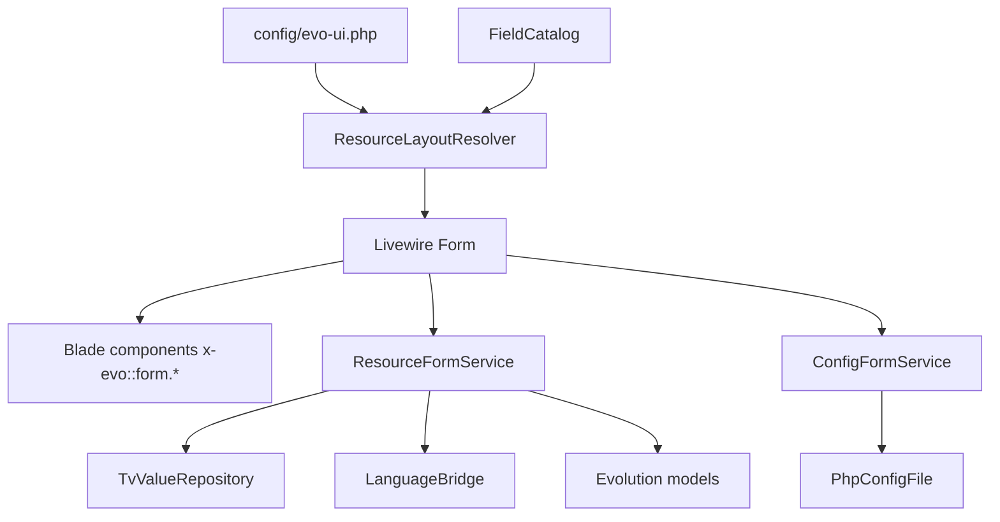

# evoUI Forms

Status: `phase-1 foundation`

This document describes the current form architecture. The goal is to keep Livewire components small and keep persistence, layout resolution, field metadata, permissions, TV storage, and multilingual behavior in separate testable layers.

## Layer Map



## Responsibilities

`EvoUI\Livewire\Form`

- Owns Livewire state: `preset`, `recordId`, `locale`, `data`, `saved`.
- Dispatches `evo-ui:form.saving`, `evo-ui:form.saved`, and `evo-ui:form.reset`.
- Validates through field `rules`.
- Filters tabs, sections, fields, and actions through `Permissions`.
- Renders the generic Blade form.
- Does not directly write resources, TVs, config files, or multilingual tables.

`ResourceLayoutResolver`

- Normalizes configured sections and fields.
- Merges field definitions with `FieldCatalog`.
- Appends template variables when `include_tvs` is enabled.
- Later this is the place for template-aware and role-aware layouts.

`FieldCatalog`

- Defines core Evo resource fields.
- Converts template variables into evoUI field definitions.
- Maps TV types into current field types such as `text`, `textarea`, `select`, `multi-checkbox`, `radio`, `number`, and `datetime`.
- Keeps TV storage metadata under `storage`.

`ResourceFormService`

- Loads and saves model-backed forms.
- Is the single persistence boundary for `site_content` forms.
- Splits base resource fields, TV fields, translated resource fields, and translated TV fields.
- Delegates TV storage to `TvValueRepository`.
- Delegates multilingual storage to `LanguageBridge`.

`TvValueRepository`

- Reads and writes native Evo TV values in `site_tmplvar_contentvalues`.
- Normalizes array values as Evo-compatible `||` strings.
- Is deliberately small because field rendering and validation belong elsewhere.

`LanguageBridge`

- Provides the sLang-compatible multilingual contract.
- Does not require sLang classes.
- Uses default-language native Evo storage.
- Uses `s_lang_content` and `s_lang_tmplvar_contentvalues` only when those tables exist.
- Resolves locales from config, then `s_lang_config`, then manager/default language.

`ConfigFormService`

- Loads and saves config-backed forms.
- Uses `PhpConfigFile` for stable PHP array writing.
- Updates only declared fields.
- Clears Evo cache after save.

`PhpConfigFile`

- Handles PHP config file IO.
- Keeps file writing out of Livewire and Blade.

## Config Contract

The form config lives under `forms`.

```php
'forms' => [
    'site_content' => [
        'source' => [
            'type' => 'model',
            'model' => \EvolutionCMS\Models\SiteContent::class,
            'key' => 'id',
            'default' => 1,
        ],
        'include_tvs' => true,
        'multilingual' => [
            'enabled' => 'auto',
            'provider' => 'sLang',
            'fields' => ['pagetitle', 'longtitle', 'description', 'introtext', 'content', 'menutitle'],
            'tvs' => [],
        ],
        'tabs' => [],
        'sections' => [],
        'actions' => [],
    ],
]
```

Rules:

- `source.type=model` uses `ResourceFormService`.
- `source.type=config` uses `ConfigFormService`.
- `sections[].fields[]` is the only source of rendered form fields.
- `enabled_fields` and `enabled_tvs` may hide fields without changing the source schema.
- `sections[].show_header=false` hides a repeated section heading when the tab already gives enough context.
- `sections[].span` supports 12-column desktop layout, for example two settings sections with `span=6`.
- `permission`, `permissions`, `any_permission`, `role`, and `roles` may be used on tabs, sections, fields, and actions.
- `save=false` fields render but do not persist.
- `invert=true` maps positive UI labels to negative Evo storage flags, for example `hidemenu`.

## Layout and View Contract

The first renderer borrows the safe generic parts from CareOffice `FormWithFG`/`FLayout`/`FLayoutCard`, but stays Evo-native:

- the Livewire form owns state, validation, save/reset events, and permission filtering;
- the Blade shell owns the sticky page header, compact right-aligned action toolbar, internal tabs, and tab panels;
- sections render through `x-evo::card`, not raw fieldsets or ad hoc panels;
- fields render through `x-evo::form.field` or a registered field view;
- config decides tabs, section labels/icons, section header visibility, fields, field order, and action definitions;
- future config may add `columns`, `slot`, `hidden`, `readonly`, and `required` without changing the shell.

Current section shape:

```php
[
    'key' => 'content',
    'tab' => 'general',
    'label' => 'evo::global.form_section_content',
    'icon' => 'file-text',
    'fields' => [
        ['name' => 'pagetitle', 'type' => 'text', 'help' => 'evo::global.help_pagetitle'],
    ],
]
```

Action toolbar rules:

- form actions render as icon-only controls on the right;
- visible labels move to `title`/`aria-label`;
- MVP save is a single `type=save` action, without split dropdown, close, continue, or create-next behavior;
- destructive actions use `danger`, primary editing uses `primary`, copy uses `info`, and save uses `success`;
- all action URLs and permissions still come from config.

Field wrapper rules:

- `label` is visible text;
- `help` renders as a question-mark tooltip beside the label;
- `description` may also feed the tooltip when `help` is absent, which preserves TV descriptions;
- `hint` renders below the input;
- validation errors render below the input and derive from Livewire `$errors`;
- custom field views must keep the same label/help/error contract.

### Resource Parent Field

The Evo resource parent field is a first-class field type, not a static display field.

```php
[
    'name' => 'parent',
    'type' => 'resource-parent',
    'display' => 'resource_parent',
    'rules' => ['required', 'integer', 'min:0'],
]
```

Contract:

- Blade renders `data-evo-resource-parent`, a hidden `wire:model.live="data.parent"` input, and the current `0 (Site)` / `id (pagetitle)` label.
- Clicking the control enables the native manager tree selection mode by setting the parent frame `tree.ca` to `parent`.
- The module exposes the legacy-compatible `window.setParent(id, title)` entrypoint because Evo 3.5 tree clicks call `w.main.setParent(...)`.
- The actual state change goes through Livewire `setResourceParent(field, id, title)`.
- The server rejects self-parent and descendant-parent loops before the value is accepted.
- JS lives in the central EvoUI adapter and initializes through `data-evo-*`; field Blade does not attach inline tree handlers.

Source audit:

- `demo/manager/actions/mutate_content.dynamic.php` uses `enableParentSelection()`, `parent.tree.ca = "parent"`, hidden `parent`, and `#parentName`.
- `demo/manager/media/style/default/js/evo.js` calls `w.main.setParent(id, title)` when the tree is in parent-selection mode.
- `templatesedit3` mirrors the same parent display pattern with `plock`, `parentName`, and hidden `parent`.

## TV Contract

Template variables are appended through `ResourceLayoutResolver`.

Each TV field is normalized like this:

```php
[
    'name' => 'tvs.12',
    'type' => 'text',
    'label' => 'Hero title',
    'storage' => [
        'type' => 'tv',
        'id' => 12,
        'name' => 'hero_title',
        'tv_type' => 'text',
    ],
]
```

Rules:

- Blade fields never decide where TV data is saved.
- `ResourceFormService` sees `storage.type=tv` and delegates to the correct repository.
- Multi-value TV fields use arrays in Livewire state and `||` strings in storage.
- Future complex TVs such as Multifields, editor, and file-picker should register field renderers and storage transformers instead of adding special cases in Blade.

## Multilingual Contract

evoUI follows the sLang storage idea without coupling to the sLang package.

- Default locale: native Evo tables.
- Non-default resource fields: `s_lang_content`.
- Non-default multilingual TVs: `s_lang_tmplvar_contentvalues`.
- If sLang tables are missing, multilingual storage is inert and the form behaves as a normal Evo form.
- `locale` is Livewire URL state, so language-specific editor screens can become shareable.

The next UI layer should add a compact language switcher on the form toolbar. It must update `locale`, reload data, and preserve dirty-state checks before switching.

## Events

Form events use the global `evo-ui:*` namespace:

- `evo-ui:form.saving`
- `evo-ui:form.saved`
- `evo-ui:form.reset`

Payload:

```php
[
    'preset' => 'site_content',
    'recordId' => 1,
    'locale' => 'uk',
]
```

Rules:

- No un-namespaced browser events.
- No direct Livewire lifecycle hooks inside field components.
- JS helpers must go through the central EvoUI/Livewire bridge.

## Extension Points

Current:

```php
EvoUI::registerFormField('field-name-or-type', 'package::view');
EvoUI::registerTableCell('cell-name', 'package::view');
```

Planned:

```php
EvoUI::registerFieldType('editor', EditorField::class);
EvoUI::registerTvRenderer('multifields', MultifieldsRenderer::class);
EvoUI::registerFieldTransformer('phpthumb.thumb', ThumbTransformer::class);
EvoUI::registerResourceLayout('site_content.default', $layout);
```

Extension rules:

- UI-edited config must store registry ids, not arbitrary PHP closures.
- Field renderers may render Blade.
- Persistence still goes through services/repositories.
- Mutating actions must authorize server-side.

## Test Contract

The current test suite checks:

- table and form configs are declarative;
- TV fields are appended from the catalog;
- TV values load and save through the service boundary;
- `ResourceFormService`, `ConfigFormService`, and `LanguageBridge` are container services;
- Livewire `Form` does not depend directly on TV repositories, config file IO, DB facades, or multilingual table names;
- form render output remains Livewire-bound and component-based;
- legacy manager stack strings are absent from source.

Run:

```bash
composer test
```

Before committing, also run:

```bash
find src config lang tests -name '*.php' -print0 | xargs -0 -n1 php -l
composer validate --no-check-publish
```

## Next Blocks

1. Add the language switcher UI for resource forms.
2. Add template/role-aware layout resolution.
3. Add `EditorAdapter` and `FilePickerBridge`.
4. Add a first `RepeaterRepository` for Multifields-compatible JSON.
5. Add `DirtyStateBridge` integration before navigation or locale switching.
